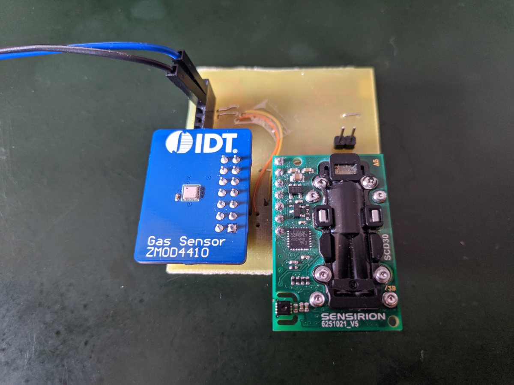
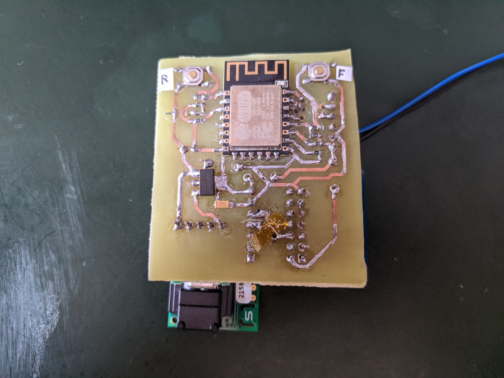

# CO2 and eCO2 sensor comparison

Small system to compare the Sensirion [SCD30](https://www.sensirion.com/en/environmental-sensors/carbon-dioxide-sensors/carbon-dioxide-sensors-co2/) (≈40€. [Mouser](https://www.mouser.es/ProductDetail/Sensirion/SCD30/?qs=rrS6PyfT74fdywu4FxpYjQ%3D%3D)) CO2 sensor and the Renesas (IDT) [ZMOD4410](https://www.renesas.com/us/en/products/sensor-products/gas-sensors/zmod4410-indoor-air-quality-sensor-platform) (≈7€. [Mouser](https://www.mouser.es/ProductDetail/Renesas-IDT/ZMOD4410AI3V/?qs=hd1VzrDQEGhLEbSZESmJlw%3D%3D)) TVOC/eCO2/IAQ one.

## Results

**Grafana board not available yet!**

## Test board

