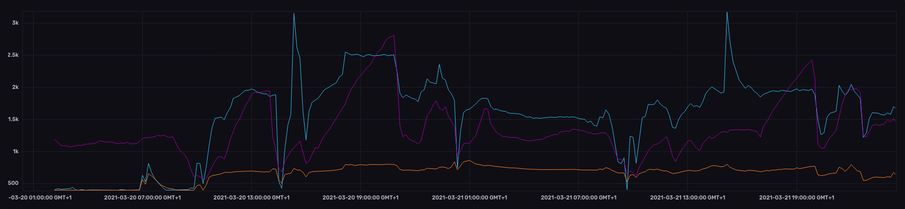

# CO2 and eCO2 sensor comparison

Small system to compare the Sensirion [SCD30](https://www.sensirion.com/en/environmental-sensors/carbon-dioxide-sensors/carbon-dioxide-sensors-co2/) (≈40€. [Mouser](https://www.mouser.es/ProductDetail/Sensirion/SCD30/?qs=rrS6PyfT74fdywu4FxpYjQ%3D%3D)) CO2 sensor, the Renesas (IDT) [ZMOD4410](https://www.renesas.com/us/en/products/sensor-products/gas-sensors/zmod4410-indoor-air-quality-sensor-platform) (≈7€. [Mouser](https://www.mouser.es/ProductDetail/Renesas-IDT/ZMOD4410AI3V/?qs=hd1VzrDQEGhLEbSZESmJlw%3D%3D)) TVOC/eCO2/IAQ sensor and the ScioSense [CCS811](https://www.sciosense.com/products/environmental-sensors/ccs811-gas-sensor-solution/) (≈7€. [Mouser](https://www.mouser.es/ProductDetail/ScioSense/CCS811B-JOPR?qs=DPoM0jnrROVuOwd2mTsTQg%3D%3D)) TVOC/eCO2 one.

## Results

All the data is stored online using InfluxDB, I will try to post all the results in a future, for now:

Blue -> CCS811

Purple -> SCD30

Orange -> ZMOD4410

 [Raw data](export/2021-03-22-00-31_chronograf_data.csv)

Notes:
 * ZMOD4410 using the 2nd GEN algorithm with a fixed period of 2s.
 * CCS811 with a fixed period of 10s.
 * CCS811 NOT using temp&rh compensation.

## Test board

Old version, not showing CCS811 sensor.

